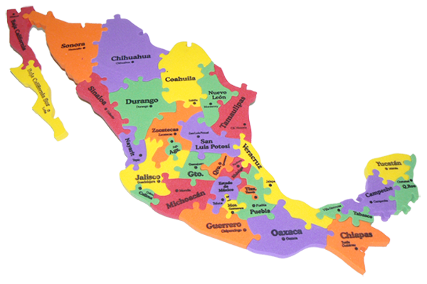
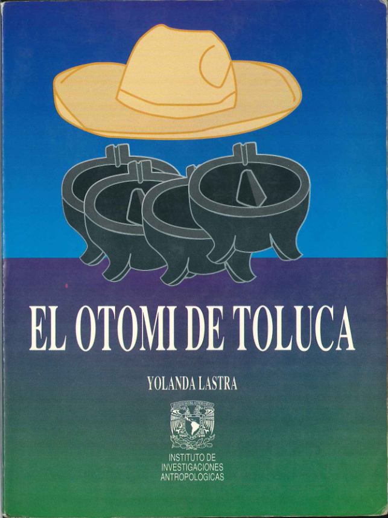
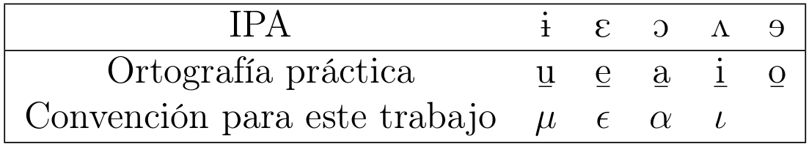
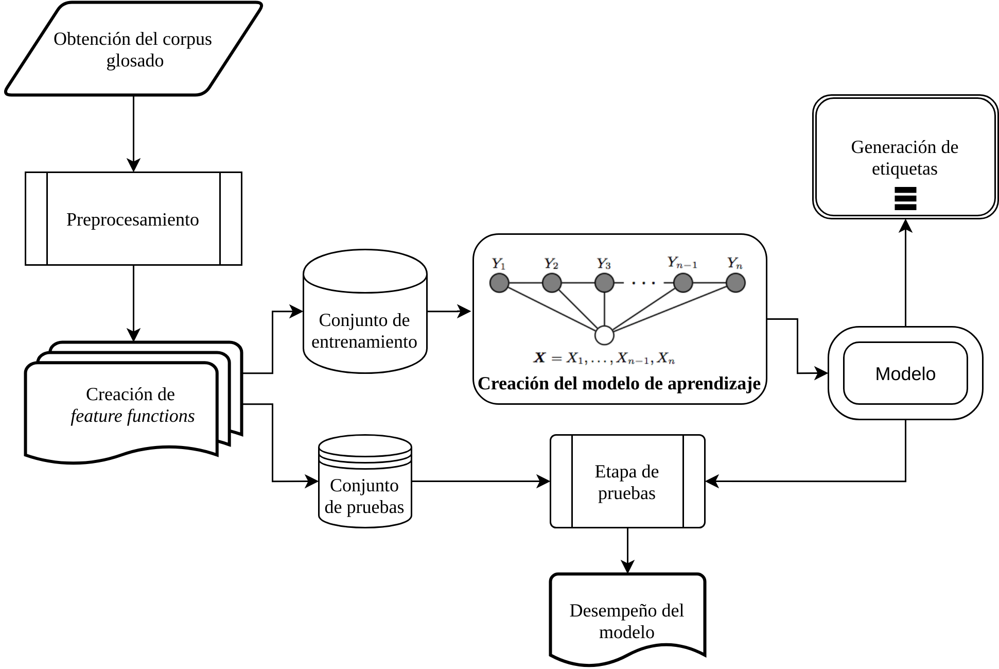
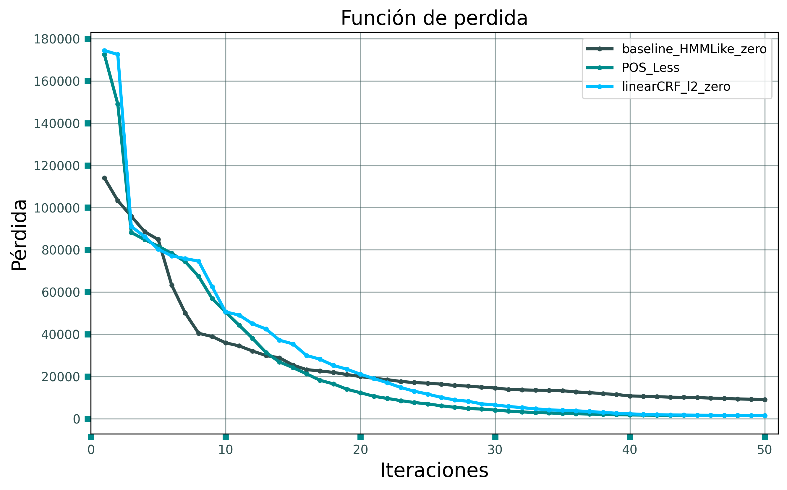
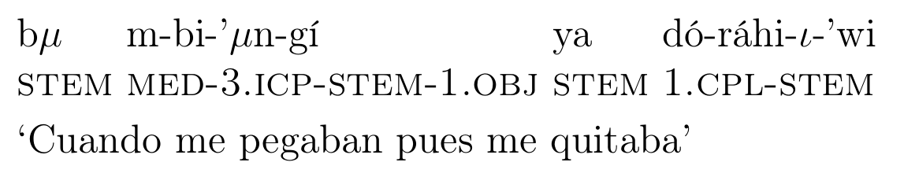
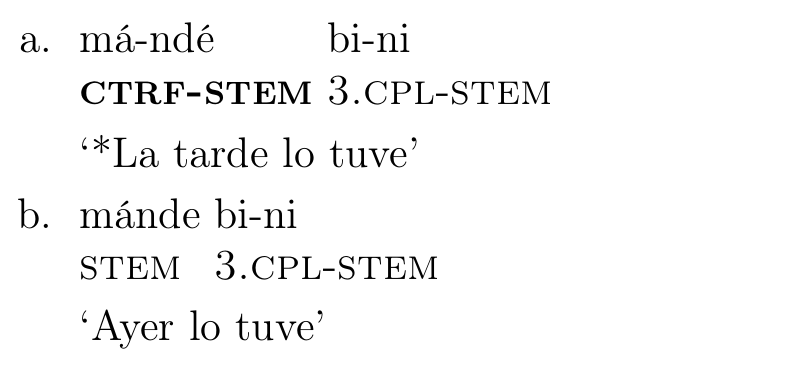

# Etiquetadores automáticos

* El etiquetado automático es una tarea que asigna etiquetas a partes de un
  texto. Estas etiquetas agregan información lingüística a estos elementos
  * Esta tarea es un paso importante para el descubrimiento de las
    estructuras lingüísticas de un corpus

. . .

* Es usual que se utilicen métodos de *Machine Learning (ML)* para la
  construcción de etiquetadores  automáticos

. . .

* En particular métodos basados en gráficas, por ejemplo Modelos Ocultos de
  Markov (*Hidden Markov Models, HMM*)


## Glosado

* El glosado es un tipo de etiquetado que brinda información acerca del
  significado y propiedades gramaticales de las palabras

. . .

* Este etiquetado de textos es de suma importancia para el análisis y la
  documentación lingüística

. . .

* Tradicionalmente el glosado se hace manualmente
  * Esto es lento y costoso ya que requiere de habilidades de un
    lingüista y un trabajo intimo con hablantes nativos, los cuales, requieren
    capacitación en lingüística básica y de software [@moeller2018automatic]
 
. . .

* La construcción de modelos automáticos que asistan este tipo de etiquetado
  surgen como **una tarea importante**

# El lenguaje natural
 
* No obstante, el lenguaje natural es **complejo**

. . . 

* Adicionalmente, existen escenarios donde los métodos tradicionales no son
  efectivos como es el caso de los **bajos recursos digitales**


# El reto: Bajos recursos digitales

{width=50%}

. . .

* Los bajos recursos digitales son un escenario común en las lenguas mexicanas

. . .

* Este entorno de experimentación supone importante **reto de investigación** 

# Objetivo

* En este trabajo esta en el marco de los bajos recursos digitales. 

. . .

* Nos enfocamos en la construcción de un **glosador para el
  otomí de Toluca**

. . .

* Diseño e implementación de un **etiquetador morfológico** basado en métodos de
  aprendizaje estructurado débilmente supervisado.

. . .

* Específicamente, *Conditional Random Fields (CRFs)* [@lafferty2001conditional]


# Corpus 

:::::::::::::: {.columns}
::: {.column width="60%"}
* Para este trabajo se utilizó un corpus en otomí basado en el trabajo de [@lastra1992otomi]

. . . 

* El corpus fue etiquetado y glosado manualmente por el
  lingüista Víctor Mijangos de la Cruz. 

. . .

* El corpus es un subconjunto del corpus paralelo español-otomí que
se encuentra en la plataforma web Tsunkua (`https://tsunkua.elotl.mx/`)
:::
::: {.column width="40%"}
{height=50%}
:::
::::::::::::::

## Convenciones



## Datos cualitativos del corpus

* La variante con la que trabajamos es de la región de San Andrés Cuexcontitlan

. . .

* Se incluyó información morfosintáctica (*Part Of Speech, POS*) y glosa

. . .

* Se agregaron 81 casos con fenómenos poco frecuentes y, por tanto,
  particularmente difíciles de predecir.
 

## Datos cuantitativos del corpus

\begin{table}
	\centering
	\begin{tabular}{| c | c |}\hline
		\textbf{Categoría} & \textbf{Cuenta} \\ \hline
		Tokens (POS) & 8578\\
		Tipos (POS) & 44\\
		Tokens (Glosa) & 14477\\
		Tipos (Glosa) & 112\\
		\textbf{Total de oraciones etiquetadas} & \textbf{1786} \\ \hline
	\end{tabular}
	\caption{Tamaño del corpus}
	\label{table:corpus_length:1}
\end{table}

\begin{table}
	\centering
	\begin{tabular}{| c | c |}\hline
		\textbf{Textos} & \textbf{Número} \\ \hline
		Narrativos & 32 \\
		Dialogados & 4  \\
		\textbf{Total de textos}  & \textbf{36} \\\hline
	\end{tabular}
	\caption{Textos del corpus}
	\label{table:corpus_text:1}
\end{table}

# Arquitectura

1. Obtención del corpus en otomí

. . .

2. Codificación

. . .

3. Preprocesamiento

. . . 

4. Fase de entrenamiento

. . .

5. Fase de evaluación

---



## *Feature Functions*

:::::::::::::: {.columns}
::: {.column width="65%"}
"hi t**ó**tsogí" (*No lo he dejado*) 

```python
[
  'bias',
  'letterLowercase=ó',
  'EOS',
  'prevpostag=neg',
  'letterposition=-5',
  'prevletter=t>',
  'nxtletter=<t',
  'nxt2letters=<ts',
  'nxt3letters=<tso',
  'nxt4letters=<tsog'
]
```
* *feature functions* de la letra **`ó`**
:::
::: {.column width="50%"}

```python
[
  [["hi", "stem"], "neg"], 
  [
    ["tó", "1.prf"],  
    ["tsogí", "stem"],
    "v"
  ]
]
```
* Frase glosada en el corpus 
:::
:::::::::::::

# Evaluación

Se propusieron tres entornos de evaluación:

1. **Baseline**: Las *feature functions* fueron reducidas al mínimo con lo que
   se **simuló** un *HMM*
2. **POSLess**: Las *feature functions* fueron construidas ignorando la
   información de las etiquetas POS
3. **LinearCRF**: Toda la información lingüística del etiquetado manual es
   utilizada para la construcción de las *feature functions*

Para validar el desempeño utilizamos la técnica de *K-folds cross-validation*
con $K=10$ para cada modelo generado. 

# Resultados

Reportamos el *accuracy* promedio por cada modelo generado en los diferentes entornos de experimentación

\begin{table}[ht]
    \centering
    \begin{tabular}{| c | c |}\hline
        \textbf{Modelo} & \textbf{Accuracy} \\\hline
        \textbf{\textsf{linearCRF\_l2\_zero}} & \textbf{0.9516}\\ 
        \textsf{POS\_Less} & 0.9499\\ 
        \textsf{baseline\_HMMLike\_zero} & 0.8762\\ \hline
    \end{tabular}
    \caption{Comparación de modelos de diferentes entornos con mejor \textit{accuracy}}
    \label{tab:models-comparation}
\end{table}

## Función de perdida



## Ejemplos



---



# Conclusiones

* La información lingüística codificada en las *feature functions* es muy importante para **mejorar el desempeño** del etiquetador.

. . .

* Notamos que las etiquetas *POS* parecen **no ser restrictivas** lo cual es bueno para lenguas de bajos recursos digitales

. . .

* Cuando quitamos información en la construcción de las *feature functions* la **frecuencia de las instancias** tiene mayor peso

. . .

* Concluimos que para entornos de bajos recursos digitales, donde la frecuencia de las instancias es menor, es necesario **brindar un contexto amplio** y agregar **información lingüística**


# Gracias | Jamädi

# ¿Dudas?

## Bibliografia

\bibliographystyle{apacite}
\bibliography{barriga_tesis}

---
title: "Glosador automático usando aprendizaje estructurado para el otomí de Toluca"
author: 
- Diego A. Barriga Martínez$^\blacklozenge$\newline
- Víctor Mijangos de la Cruz$^\blacklozenge$\newline
- Ximena Gutierrez-Vasques$^\clubsuit$
institute: 
- Universidad Nacional Autónoma de México$^\blacklozenge$
- Universidad de Zúrich$^\clubsuit$
theme: metropolis
colortheme: default 
date: "5 de Noviembre 2020"
navigation: horizontal
---
